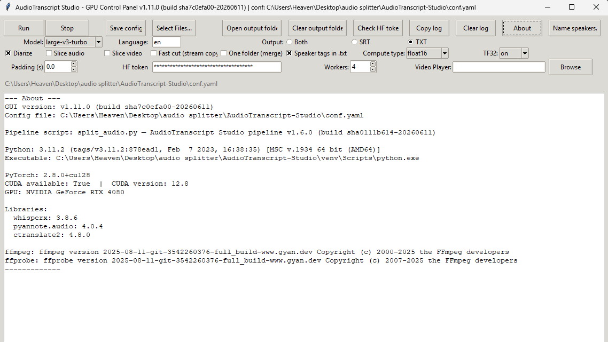
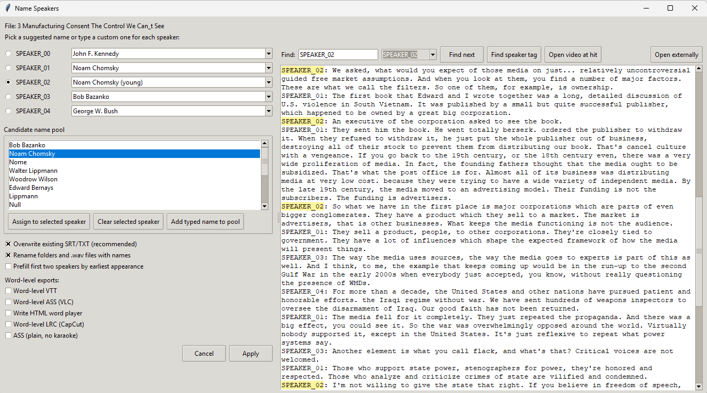
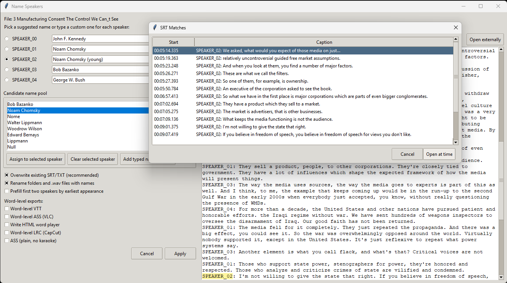

# AudioTranscript Studio

AudioTranscript Studio is a Windows GUI app for local audio/video transcription, speaker diarization, speaker naming, subtitle export, and audio segment extraction.

It uses WhisperX, PyTorch CUDA, pyannote, FFmpeg, and a local NVIDIA GPU when available.

This project began as a fork of `JarodMica/audiosplitter_whisper` and has been expanded with a larger GUI workflow, Hugging Face token handling, speaker naming tools, subtitle export options, word-level exports, and easier setup utilities.

---

## What It Does

AudioTranscript Studio can:

* Transcribe audio and video files
* Create speaker-labeled transcripts
* Create SRT subtitle files
* Create TXT transcript files
* Run speaker diarization
* Rename speakers after processing
* Export speaker audio clips
* Optionally cut video/audio segments
* Export word-level subtitle formats
* Open video at transcript/SRT matches
* Run locally on your own PC

---

---

## Screenshots

### Main GUI and System Check



### Speaker Naming



### Open Video at Subtitle Hit



## Privacy Note

AudioTranscript Studio runs the transcription workflow locally on your computer.

Your audio/video is not sent to a paid cloud transcription API by this app.

The app may contact the internet to download models from Hugging Face the first time you use them. A Hugging Face token may be required for speaker diarization models.

---

## Recommended System

Recommended:

* Windows 10 or Windows 11
* NVIDIA GPU
* Updated NVIDIA driver
* Python 3.11
* FFmpeg
* Hugging Face account and access token for diarization

Tested new-stack environment:

```text
Windows 11
Python 3.11.2
NVIDIA RTX GPU
PyTorch 2.8.0+cu128
WhisperX 3.8.6
pyannote.audio 4.0.4
ctranslate2 4.8.0
FFmpeg installed
```

CPU mode may work, but it will be much slower and is not the main target.

---

## Beginner Install, CUDA/NVIDIA

This is the recommended install method.

### Step 1: Install Python 3.11

Install Python 3.11 for Windows.

During installation, check:

```text
Add python.exe to PATH
```

After installing Python, close and reopen your terminal or File Explorer windows if needed.

### Step 2: Install FFmpeg

FFmpeg is required for audio/video conversion.

If you use Windows Package Manager, you can install it with:

```powershell
winget install Gyan.FFmpeg
```

After installing FFmpeg, close and reopen your terminal or restart Windows if the app still cannot find `ffmpeg`.

### Step 3: Download AudioTranscript Studio

On GitHub, click:

```text
Code -> Download ZIP
```

Extract the ZIP somewhere simple, such as:

```text
Desktop
Documents
```

Avoid deeply nested folders or protected system folders.

### Step 4: Run the installer

Open the extracted project folder and double-click:

```text
install-cuda.bat
```

The installer will:

* Create a local `venv`
* Install CUDA PyTorch
* Install WhisperX and dependencies
* Create required data folders
* Create `conf.yaml` if missing
* Check CUDA
* Check package versions
* Check FFmpeg

The first install can take a while because it downloads large packages.

### Step 5: Add your Hugging Face token

Open:

```text
conf.yaml
```

Find the Hugging Face token line and add your token.

Example:

```yaml
hf_token: "YOUR_HUGGING_FACE_TOKEN_HERE"
```

Do not share your token.

Do not upload your `conf.yaml` to GitHub.

### Step 6: Run the app

Double-click:

```text
run-gui.bat
```

The GUI should open.

Click:

```text
About
```

You want to see something like:

```text
CUDA available: True
GPU: your NVIDIA GPU
```

---

## Hugging Face Token and Diarization

Speaker diarization may require a Hugging Face account, an access token, and accepted model conditions.

For the current CUDA stack, accept access for this model:

* [pyannote/speaker-diarization-community-1](https://huggingface.co/pyannote/speaker-diarization-community-1)

General steps:

1. Create or sign in to a [Hugging Face account](https://huggingface.co/join).
2. Open the [pyannote speaker diarization Community-1 model page](https://huggingface.co/pyannote/speaker-diarization-community-1).
3. Accept the model conditions on Hugging Face.
4. Create a Hugging Face access token here: [Hugging Face tokens](https://huggingface.co/settings/tokens).
5. Open your local `conf.yaml`.
6. Paste your token into the `hf_token` field.
7. Use the app's `Check HF token` button.

Example:

```yaml
hf_token: "YOUR_HUGGING_FACE_TOKEN_HERE"
```

Do not share your token.

Do not upload your `conf.yaml` to GitHub.

If diarization fails, check:

* Your token is correct
* The token is saved in `conf.yaml`
* You accepted the required pyannote model conditions
* You have internet access the first time models are downloaded

---

---

## Basic Workflow

1. Open the app with `run-gui.bat`.
2. Click `Select Files`.
3. Choose an audio or video file.
4. Choose a model.

Recommended fast model:

```text
large-v3-turbo
```

5. Choose settings such as diarization, output format, TF32, and workers.
6. Click `Run`.
7. After processing, click `Open output folder`.
8. Click `Name speakers` if you want to replace labels like `SPEAKER_00` with real names.
9. Click `Apply` to update transcripts/subtitles with speaker names.

---

## Speaker Naming

After processing, the app can open a speaker naming window.

You can:

* Type speaker names manually
* Pick names from a candidate name pool
* Assign a candidate name to a selected speaker
* Clear a speaker name
* Search speaker tags in the transcript
* Open the video at matching subtitle hits
* Rewrite SRT/TXT files with the chosen names

The candidate name pool is only a helper. The app cannot always know who is speaking, especially when the transcript mentions historical figures, authors, or topic names.

---

## Output Files

For each processed file, the app may create files such as:

```text
segments.json
speakers.json
.srt subtitle file
.txt transcript file
speaker folders
audio clips
word-level subtitle exports
```

Most output is saved under:

```text
data/output/
```

Converted WAV files may be saved under:

```text
data/wav_files/
```

---

## Folder Structure

Expected folders:

```text
data/
  input/
  output/
  wav_files/
```

You can use `Select Files` in the GUI instead of copying files into `data/input`.

---

## Troubleshooting

### The GUI says CUDA is not available

Check that:

* You have an NVIDIA GPU
* Your NVIDIA driver is installed and updated
* You ran `install-cuda.bat`
* The app is using the project `venv`

You can test CUDA with:

```powershell
.\venv\Scripts\python.exe -c "import torch; print(torch.__version__); print(torch.cuda.is_available()); print(torch.version.cuda); print(torch.cuda.get_device_name(0) if torch.cuda.is_available() else 'no cuda')"
```

Expected result:

```text
CUDA available: True
```

### FFmpeg is missing

Install FFmpeg:

```powershell
winget install Gyan.FFmpeg
```

Then restart your terminal or restart Windows.

### Python was not found

Install Python 3.11 and make sure `Add python.exe to PATH` is checked.

If Windows opens the Microsoft Store instead, disable Python App Execution Aliases in Windows settings or install Python from the official Python installer.

### Diarization does not work

Check:

* Hugging Face token is saved in `conf.yaml`
* Token is valid
* Required model terms are accepted
* Internet is available for first model download

### Smart App Control blocks Python files

Some Windows systems may block Python `.pyd` files inside the virtual environment.

If you see an error such as:

```text
An Application Control policy has blocked this file
```

check Windows Smart App Control / security settings. This is a Windows security policy issue, not a transcription model issue.

### The installer takes a long time

This is normal on the first install. CUDA PyTorch and model dependencies are large.

---

## Files That Should Not Be Uploaded

Do not upload:

```text
conf.yaml
venv/
venv_old_working/
__pycache__/
data/input/*
data/output/*
data/wav_files/*
*.bak
private backup folders
```

The repo should include:

```text
conf.example.yaml
```

but not your private:

```text
conf.yaml
```

---

## Developer Notes

Useful commands:

```powershell
python -m py_compile .\split_audio_gui.py
python -m py_compile .\setup-cuda.py
git status
```

Run the GUI directly:

```powershell
.\venv\Scripts\python.exe split_audio_gui.py
```

---

## Credits

AudioTranscript Studio began as a fork of `JarodMica/audiosplitter_whisper`.

Original project copyright:

```text
Copyright (c) 2023 Jarod Mica
```

Modifications copyright:

```text
Copyright (c) 2026 Comput3rUs3r
```

This project is licensed under the MIT License.

---

## License

This project uses the MIT License.

See the `LICENSE` file for details.
