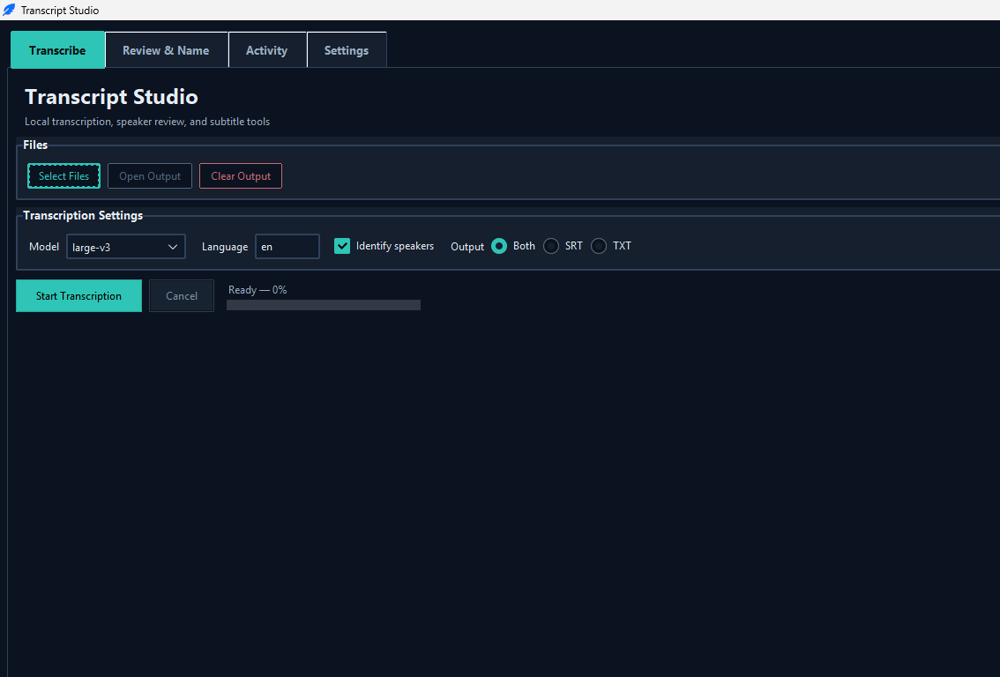
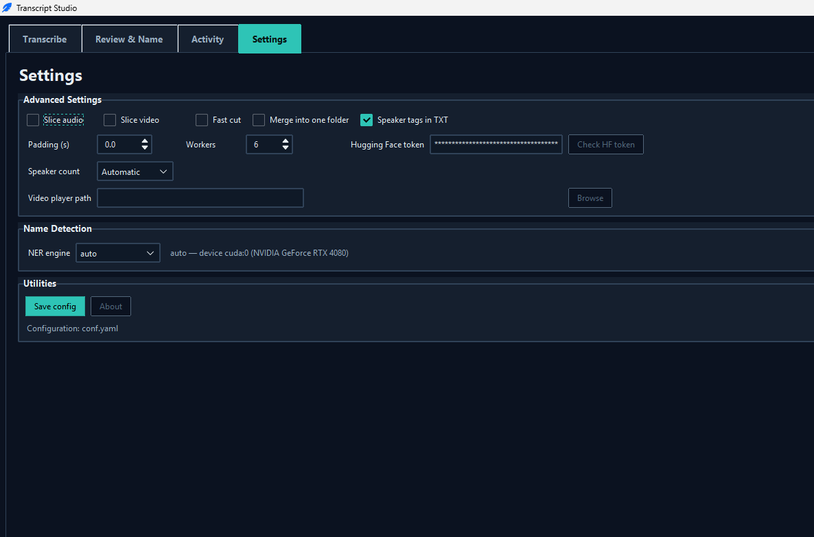
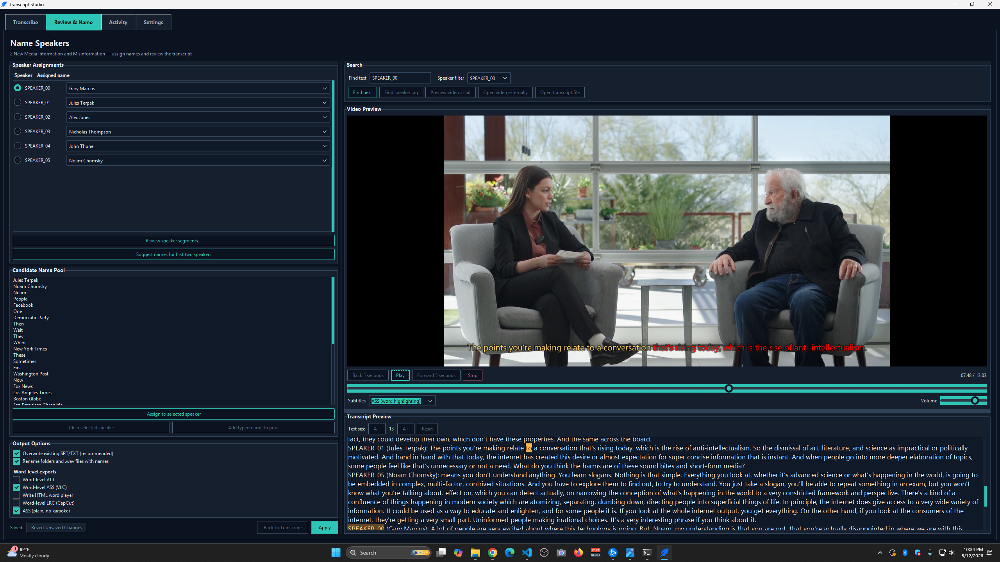
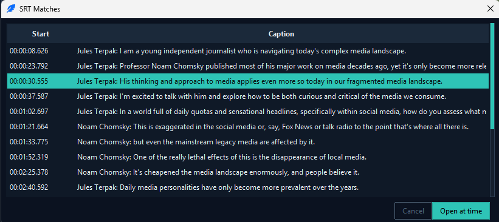

# AudioTranscript Studio

AudioTranscript Studio is a Windows GUI app for local audio/video transcription, speaker diarization, speaker naming, subtitle export, and audio segment extraction.

It uses WhisperX, PyTorch CUDA, pyannote, FFmpeg, and a CUDA-capable NVIDIA GPU. The current transcription pipeline requires CUDA and does not support CPU-only processing.

This project began as a fork of `JarodMica/audiosplitter_whisper` and has been expanded with a larger GUI workflow, Hugging Face token handling, speaker naming tools, subtitle export options, word-level exports, and easier setup utilities.

---

## What It Does

AudioTranscript Studio can:

* Transcribe audio and video files
* Create speaker-labeled transcripts
* Create SRT subtitle files
* Create TXT transcript files
* Run speaker diarization
* Rename speakers after processing
* Export speaker audio clips
* Optionally cut video/audio segments
* Export word-level subtitle formats
* Open video at transcript/SRT matches
* Run locally on your own PC

---

## Screenshots

### Modern Main Interface

The filename is retained for compatibility, but this image shows the modern main workflow and Activity log.



### Advanced Settings



### Speaker Naming



### SRT Matches



---

## Modern GUI Overview

The interface uses the Litera theme from `ttkbootstrap` for a clean, consistent Windows layout. The main window keeps the normal workflow focused on:

* Selecting files
* Choosing the model, language, speaker identification, and output format
* Starting or cancelling transcription
* Opening completed output

Less frequently used controls are kept in the collapsible `Advanced Settings` section. The `Activity` log uses most of the expandable window space and reports configuration saves, validation messages, subprocess output, and completion information.

Use `Start Transcription` to begin, `Cancel` to request cancellation, and `Open Output` to open `data/output` in File Explorer.

---

## Privacy Note

AudioTranscript Studio runs the transcription workflow locally on your computer.

Your audio/video is not sent to a paid cloud transcription API by this app.

The app may contact the internet to download models from Hugging Face the first time you use them. A Hugging Face token may be required for speaker diarization models.

---

## Recommended System

Recommended:

* Windows 10 or Windows 11
* CUDA-capable NVIDIA GPU required by the current pipeline
* Updated NVIDIA driver
* Python 3.11
* FFmpeg
* Hugging Face account and access token for diarization

Tested new-stack environment:

```text
Windows 11
Python 3.11.2
NVIDIA RTX GPU
PyTorch 2.8.0+cu128
WhisperX 3.8.6
pyannote.audio 4.0.4
ctranslate2 4.8.0
ttkbootstrap 2.1.1
FFmpeg installed
```

`ttkbootstrap==2.1.1` is included in the project's requirements files and is installed automatically by the normal setup process. You do not need to install it separately.

---

## Beginner Install, CUDA/NVIDIA

This is the recommended install method.

### Step 1: Install Python 3.11

Install Python 3.11 for Windows.

During installation, check:

```text
Add python.exe to PATH
```

After installing Python, close and reopen your terminal or File Explorer windows if needed.

### Step 2: Install FFmpeg

FFmpeg is required for audio/video conversion.

If you use Windows Package Manager, you can install it with:

```powershell
winget install Gyan.FFmpeg
```

After installing FFmpeg, close and reopen your terminal or restart Windows if the app still cannot find `ffmpeg`.

### Step 3: Download AudioTranscript Studio

On GitHub, click:

```text
Code -> Download ZIP
```

Extract the ZIP somewhere simple, such as:

```text
Desktop
Documents
```

Avoid deeply nested folders or protected system folders.

### Step 4: Run the installer

Open the extracted project folder and double-click:

```text
install-cuda.bat
```

The installer will:

* Create a local `venv`
* Install CUDA PyTorch
* Install WhisperX and dependencies
* Install the `ttkbootstrap` GUI dependency
* Create required data folders
* Create `conf.yaml` if missing
* Check CUDA
* Check package versions
* Check FFmpeg

The first install can take a while because it downloads large packages.

### Step 5: Prepare Hugging Face access for diarization

If you plan to use `Identify speakers`, you will need a Hugging Face token and access to the required pyannote model. After opening the GUI in the next step, expand `Advanced Settings`, enter the token in `Hugging Face token`, and click `Check HF token`.

You can also save the token manually. Open:

```text
conf.yaml
```

Find the Hugging Face token line and add your token.

Example:

```yaml
hf_token: "YOUR_HUGGING_FACE_TOKEN_HERE"
```

Do not share your token.

Do not upload your `conf.yaml` to GitHub.

### Step 6: Run the app

Double-click:

```text
run-gui.bat
```

The GUI should open.

Click:

```text
About
```

You want to see something like:

```text
CUDA available: True
GPU: your NVIDIA GPU
```

---

## Hugging Face Token and Diarization

Speaker diarization may require a Hugging Face account, an access token, and accepted model conditions.

For the current CUDA stack, accept access for this model:

* [pyannote/speaker-diarization-community-1](https://huggingface.co/pyannote/speaker-diarization-community-1)

General steps:

1. Create or sign in to a [Hugging Face account](https://huggingface.co/join).
2. Open the [pyannote speaker diarization Community-1 model page](https://huggingface.co/pyannote/speaker-diarization-community-1).
3. Accept the model conditions on Hugging Face.
4. Create a Hugging Face access token here: [Hugging Face tokens](https://huggingface.co/settings/tokens).
5. In the app, expand `Advanced Settings`.
6. Paste the token into `Hugging Face token` and click `Save config`.
7. Click `Check HF token`.

Alternatively, open your local `conf.yaml` and paste the token into the `hf_token` field.

Example:

```yaml
hf_token: "YOUR_HUGGING_FACE_TOKEN_HERE"
```

Do not share your token.

Do not upload your `conf.yaml` to GitHub.

If diarization fails, check:

* Your token is correct
* The token is saved in `conf.yaml`
* You accepted the required pyannote model conditions
* You have internet access the first time models are downloaded

---

## Basic Workflow

1. Open the app with `run-gui.bat`.
2. Click `Select Files`.
3. Choose one or more supported audio or video files.
4. Choose the model, language, whether to `Identify speakers`, and the output format.

Recommended fast model:

```text
large-v3-turbo
```

5. Expand `Advanced Settings` only if you need slicing, worker, token, or video-player options.
6. Click `Start Transcription`.
7. Use `Cancel` if you need to stop the active run.
8. After successful processing, click `Open Output`.
9. Click `Name speakers` if you want to replace labels such as `SPEAKER_00` with names.
10. Review the assignments and click `Apply` to save the selected speaker-name and export changes.

The GUI normally processes the files chosen through `Select Files`. If you reopen the file chooser and cancel without choosing files, the explicit selection is cleared. The next run uses the same project-folder discovery as the pipeline: supported media under `data/input`, plus WAV files under `data/wav_files` when an original input with the same name is not available.

---

## Runtime Status and Progress

The compact status label and action controls show what the app is doing:

* `Ready`: `Start Transcription` is enabled, `Cancel` is disabled, and progress is stopped.
* `Running`: Start is disabled, Cancel is enabled, and the indeterminate progress indicator is active.
* `Cancelling`: the cancellation request has been sent and Cancel is disabled to prevent repeated requests.
* `Cancelled`: a deliberately cancelled run has ended.
* `Complete`: processing exited successfully.
* `Failed`: the process could not start or exited with an error.

After `Cancelled`, `Complete`, or `Failed`, Start is enabled again, Cancel is disabled, and the progress indicator stops. The progress bar is intentionally indeterminate; it shows activity rather than a made-up percentage.

---

## Automatic Precision Policy

CUDA transcription uses `float16` automatically. TF32 is kept off for reliable, reproducible diarization behavior.

Compute Type and TF32 are technical implementation settings, so their controls are intentionally hidden from the main interface. You do not need to choose or tune them in the GUI.

---

## Advanced Settings

Click `Advanced Settings` to expand or collapse these controls:

* `Slice audio`: create audio clips for transcript segments.
* `Slice video`: create video clips from supported video source files.
* `Fast cut`: use the faster video-cutting option when slicing video.
* `Merge into one folder`: collect generated segment clips in one folder.
* `Speaker tags in TXT`: include speaker labels in TXT output.
* `Padding`: add time before and after generated clips.
* `Workers`: control the existing parallel worker count.
* `Hugging Face token`: store the token used for diarization model access.
* `Check HF token`: validate token/model access before a transcription run.
* `Video player path`: choose the external player used by transcript and subtitle playback tools.

`Slice video` requires an actual supported video input. If all effective inputs contain audio only, the GUI blocks the run and explains how to correct it. For a mixture of audio and video files, the GUI asks for confirmation because audio-only files can be transcribed but cannot produce video clips. This validation does not disable `Slice audio` or change the saved Slice video setting.

---

## Name Speakers

After diarized processing, click `Name speakers` to review detected speakers in a responsive two-column window.

You can:

* Select a speaker with its radio button and edit the corresponding name field.
* Pick a name from the scrollable Candidate Name Pool and assign it to the selected speaker.
* Type a custom name, use it directly, or add it to the candidate pool.
* Clear the selected speaker's assigned name.
* Use Find text, Speaker filter, Find next, and Find speaker tag to navigate the transcript.
* Review the large, scrollable Transcript Preview.
* Open the video at the current hit or open the media externally.
* Choose whether to overwrite SRT/TXT, rename folders and WAV files, or prefill the first speakers.
* Request word-level VTT, karaoke ASS, HTML word player, LRC, or plain ASS exports when word timing is available.

`Apply` saves the speaker mapping and performs the selected rename, transcript, subtitle, and word-level export updates. `Cancel` closes the dialog without applying those changes.

The candidate name pool is only a helper. The app cannot always know who is speaking, especially when the transcript mentions historical figures, authors, or topic names.

---

## SRT Matches

When a transcript search is opened as SRT matches, the first result is selected automatically. The dialog uses single selection and a visible highlighted row so it is clear which timestamp will open. The highlight remains visible when focus moves to the `Open at time` button.

Click another row to change the selection, then click `Open at time`. You can also double-click a result to start playback at that timestamp.

---

## Output Files

For each processed file, the app may create files such as:

```text
segments.json
speakers.json
.srt subtitle file
.txt transcript file
speaker folders
audio clips
word-level subtitle exports
```

Most output is saved under:

```text
data/output/
```

Converted WAV files may be saved under:

```text
data/wav_files/
```

---

## Folder Structure

Expected folders:

```text
data/
  input/
  output/
  wav_files/
```

You can use `Select Files` in the GUI instead of copying files into `data/input`.

---

## Troubleshooting

### The GUI says CUDA is not available

Check that:

* You have an NVIDIA GPU
* Your NVIDIA driver is installed and updated
* You ran `install-cuda.bat`
* The app is using the project `venv`

You can test CUDA with:

```powershell
.\venv\Scripts\python.exe -c "import torch; print(torch.__version__); print(torch.cuda.is_available()); print(torch.version.cuda); print(torch.cuda.get_device_name(0) if torch.cuda.is_available() else 'no cuda')"
```

Expected result:

```text
CUDA available: True
```

### FFmpeg is missing

Install FFmpeg:

```powershell
winget install Gyan.FFmpeg
```

Then restart your terminal or restart Windows.

### Python was not found

Install Python 3.11 and make sure `Add python.exe to PATH` is checked.

If Windows opens the Microsoft Store instead, disable Python App Execution Aliases in Windows settings or install Python from the official Python installer.

### ttkbootstrap is missing from an older venv

If an older existing environment reports `ModuleNotFoundError: No module named 'ttkbootstrap'`, rerun `install-cuda.bat` so the project requirements are installed into the local `venv`. The requirements pin `ttkbootstrap==2.1.1`; a separate system-wide installation is not needed.

### Diarization does not work

Check:

* Hugging Face token is saved in `conf.yaml`
* Token is valid
* Required model terms are accepted
* Internet is available for first model download

### Smart App Control blocks Python files

Some Windows systems may block Python `.pyd` files inside the virtual environment.

If you see an error such as:

```text
An Application Control policy has blocked this file
```

check Windows Smart App Control / security settings. This is a Windows security policy issue, not a transcription model issue.

### The installer takes a long time

This is normal on the first install. CUDA PyTorch and model dependencies are large.

---

## Files That Should Not Be Uploaded

Do not upload:

```text
conf.yaml
venv/
venv_old_working/
__pycache__/
data/input/*
data/output/*
data/wav_files/*
*.bak
private backup folders
```

The repo should include:

```text
conf.example.yaml
```

but not your private:

```text
conf.yaml
```

---

## Developer Notes

Useful commands:

```powershell
python -m py_compile .\split_audio_gui.py
python -m py_compile .\setup-cuda.py
git status
```

Run the GUI directly:

```powershell
.\venv\Scripts\python.exe split_audio_gui.py
```

---

## Credits

AudioTranscript Studio began as a fork of `JarodMica/audiosplitter_whisper`.

Original project copyright:

```text
Copyright (c) 2023 Jarod Mica
```

Modifications copyright:

```text
Copyright (c) 2026 Comput3rUs3r
```

This project is licensed under the MIT License.

---

## License

This project uses the MIT License.

See the `LICENSE` file for details.
