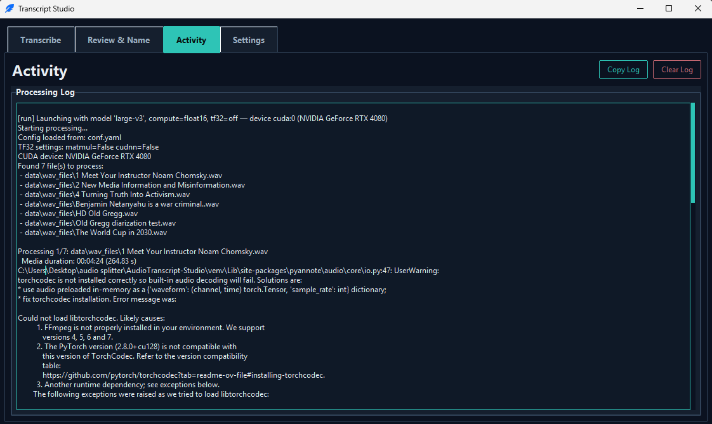
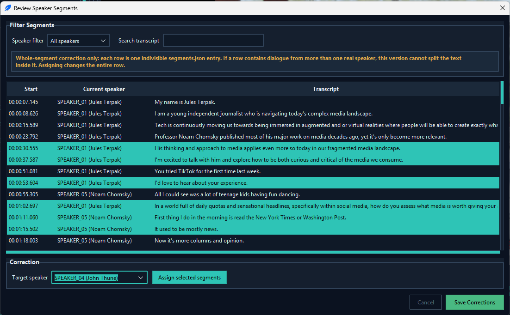

# Transcript Studio

**Local transcription, speaker review, and subtitle tools.**

Transcript Studio is a Windows GUI app for local audio/video transcription, speaker diarization, speaker review and correction, subtitle export, and media-segment extraction.

It uses WhisperX, PyTorch CUDA, pyannote, FFmpeg, and a CUDA-capable NVIDIA GPU. The current transcription pipeline requires CUDA and does not support CPU-only processing.

This project began as a fork of `JarodMica/audiosplitter_whisper` and has been expanded with a larger GUI workflow, Hugging Face token handling, speaker naming tools, subtitle export options, word-level exports, and easier setup utilities.

---

## What It Does

Transcript Studio can:

* Transcribe audio and video files
* Create speaker-labeled transcripts
* Create SRT subtitle files
* Create TXT transcript files
* Run speaker diarization
* Review, name, and manually correct speakers after processing
* Export speaker audio clips
* Optionally cut video/audio segments
* Export word-level subtitle formats
* Preview video inside the app and jump to transcript words or SRT matches
* Run locally on your own PC

---

## Screenshots

### Transcribe

The older filename is retained for compatibility, but this image shows the current Transcribe page.


### Settings

The Settings page keeps advanced processing, name-detection, and configuration controls together.


### Review & Name

The persistent Review & Name page combines speaker tools, embedded video, and the synchronized transcript.


### Activity

The Activity page provides the full live processing log and log utilities.



### Review Speaker Segments

The correction dialog shows each individual `segments.json` entry as a separately selectable row.



### SRT Matches


---

## Unified Workspace

Transcript Studio uses a persistent four-page workspace with the custom Midnight Studio dark theme:

* `Transcribe` contains the normal transcription workflow and run status.
* `Review & Name` keeps the latest loaded result, speaker edits, video state, and transcript state alive while you visit other pages.
* `Activity` contains the full processing log.
* `Settings` contains advanced processing, Hugging Face, name-detection, and configuration controls.

Processing stays inside the same application. After a successful run, the final valid result is loaded into `Review & Name` automatically and that tab opens. Normal application workflows no longer open speaker naming in a separate window. Focused confirmations, warnings, `Review Speaker Segments`, and `SRT Matches` still use dialogs.

### Transcribe

Use this page to:

* Select one or more audio or video files.
* Open or clear generated output.
* Choose the WhisperX model, language, `Identify speakers`, and output format (`Both`, `SRT`, or `TXT`).
* Start transcription, request cancellation, and follow phase-based percentage progress.

`Clear Output` removes generated content under `data/output` while preserving its `.gitkeep` file. It does not remove persistent speaker-name records under `data/speaker_names`.

### Review & Name

The embedded review workspace includes:

* Speaker assignment fields and a scrollable Candidate Name Pool.
* `Suggest names for first two speakers`, which fills only empty fields when credible candidates are available.
* `Review speaker segments...` for assigning one or more individual transcript segments to an existing speaker.
* An embedded VLC video preview with play/pause, five-second jumps, stop, seek, volume, and subtitle controls.
* Transcript and speaker search, `SRT Matches`, embedded preview at a hit, external video playback, and transcript-file opening.
* Clickable timed words that seek playback to the word's exact start time.
* Playback-synchronized current-word highlighting that remains visually distinct from Find highlighting.
* A subtitle selector offering `Off`, `SRT`, `ASS (plain)`, and `ASS (word highlighting)` when those files exist.
* Resizable speaker/video and video/transcript panes plus adjustable transcript text size.
* Output options for SRT/TXT replacement, folder/WAV renaming, and optional word-level exports.

The `Saved`/`Unsaved changes` indicator tracks speaker names, candidate-pool changes, manual corrections, and output options. `Revert Unsaved Changes` restores the last loaded or applied state. `Back to Transcribe` changes tabs without unloading the review workspace or discarding edits, playback state, search state, or the loaded result.

`Apply` stages and validates requested metadata, transcript, subtitle, and optional export files before replacing existing files. If replacement unexpectedly fails, it attempts to restore the original files. When VLC may be holding an SRT or ASS file open on Windows, the app temporarily detaches the media from the same player and restores the video, time, playing/paused state, volume, and selected subtitle afterward. A successful Apply immediately refreshes both the available subtitle choices and the assigned names shown in Transcript Preview.

Manual speaker correction works on whole `segments.json` entries. Each displayed row is one indivisible segment; this version cannot split dialogue between two real speakers inside a single row. `Save Corrections` returns the working corrections to Review & Name, where they remain unsaved until `Apply` commits them. Cancelling the correction dialog discards its working copy.

### Activity

The live processing log continues receiving subprocess, validation, and configuration messages even while another tab is open. Use `Copy Log` to copy all visible log text or `Clear Log` to clear the on-screen log.

### Settings

The Settings page includes:

* `Slice audio`, `Slice video`, `Fast cut`, and `Merge into one folder`.
* `Speaker tags in TXT`, clip `Padding`, and `Workers`.
* Concealed Hugging Face token entry and `Check HF token`.
* Speaker-count modes: `Automatic`, `Exact number`, or `Range`.
* External `Video player path` and its Browse control.
* NER engine selection for candidate-name detection.
* `Save config` and `About`.

`Slice video` requires an actual supported video input. The GUI blocks an audio-only run with an explanation and asks for confirmation when a selection mixes audio and video. It does not disable `Slice audio` or silently change the saved Slice video setting.

### Appearance and Saved Preferences

The Midnight Studio theme provides the dark navy/slate interface, teal actions and selections, and distinct amber transcript highlights. The main window's restored geometry and maximized state are saved when an approved application shutdown completes. Review & Name also saves the proportional positions of both pane dividers and the transcript font size.

---

## Privacy Note

Transcript Studio runs the transcription workflow locally on your computer.

Your audio/video is not sent to a paid cloud transcription API by this app.

The app may contact the internet to download models from Hugging Face the first time you use them. A Hugging Face token may be required for speaker diarization models.

---

## Recommended System

Recommended:

* Windows 10 or Windows 11
* CUDA-capable NVIDIA GPU required by the current pipeline
* Updated NVIDIA driver
* Python 3.11
* FFmpeg
* Hugging Face account and access token for diarization
* VLC desktop application for embedded video preview

Tested new-stack environment:

```text
Windows 11
Python 3.11.2
NVIDIA RTX GPU
PyTorch 2.8.0+cu128
WhisperX 3.8.6
pyannote.audio 4.0.4
ctranslate2 4.8.0
ttkbootstrap 2.1.1
FFmpeg installed
```

`ttkbootstrap==2.1.1` is included in the project's requirements files and is installed automatically by the normal setup process. You do not need to install it separately.

The requirements also install `python-vlc==3.0.21203`, the Python binding used by the embedded player. Embedded playback additionally needs the VLC desktop application installed on Windows. If LibVLC is unavailable, the rest of the application still opens and the external video controls remain available.

---

## Beginner Install, CUDA/NVIDIA

This is the recommended install method.

### Step 1: Install Python 3.11

Install Python 3.11 for Windows.

During installation, check:

```text
Add python.exe to PATH
```

After installing Python, close and reopen your terminal or File Explorer windows if needed.

### Step 2: Install FFmpeg

FFmpeg is required for audio/video conversion.

If you use Windows Package Manager, you can install it with:

```powershell
winget install Gyan.FFmpeg
```

After installing FFmpeg, close and reopen your terminal or restart Windows if the app still cannot find `ffmpeg`.

### Step 3: Download Transcript Studio

On GitHub, click:

```text
Code -> Download ZIP
```

Extract the ZIP somewhere simple, such as:

```text
Desktop
Documents
```

Avoid deeply nested folders or protected system folders.

### Step 4: Run the installer

Open the extracted project folder and double-click:

```text
install-cuda.bat
```

The installer will:

* Create a local `venv`
* Install CUDA PyTorch
* Install WhisperX and dependencies
* Install the `ttkbootstrap` GUI dependency
* Install the `python-vlc` embedded-player binding
* Create required data folders
* Create `conf.yaml` if missing
* Check CUDA
* Check package versions
* Check FFmpeg

The first install can take a while because it downloads large packages.

### Step 5: Prepare Hugging Face access for diarization

If you plan to use `Identify speakers`, you will need a Hugging Face token and access to the required pyannote model. After opening the GUI in the next step, open `Settings`, enter the token in `Hugging Face token`, and click `Check HF token`.

You can also save the token manually. Open:

```text
conf.yaml
```

Find the Hugging Face token line and add your token.

Example:

```yaml
hf_token: "YOUR_HUGGING_FACE_TOKEN_HERE"
```

Do not share your token.

Do not upload your `conf.yaml` to GitHub.

### Step 6: Run the app

Double-click:

```text
run-gui.bat
```

The GUI should open. Open `Settings`, then click:

```text
About
```

You want to see something like:

```text
CUDA available: True
GPU: your NVIDIA GPU
```

---

## Hugging Face Token and Diarization

Speaker diarization may require a Hugging Face account, an access token, and accepted model conditions.

For the current CUDA stack, accept access for this model:

* [pyannote/speaker-diarization-community-1](https://huggingface.co/pyannote/speaker-diarization-community-1)

General steps:

1. Create or sign in to a [Hugging Face account](https://huggingface.co/join).
2. Open the [pyannote speaker diarization Community-1 model page](https://huggingface.co/pyannote/speaker-diarization-community-1).
3. Accept the model conditions on Hugging Face.
4. Create a Hugging Face access token here: [Hugging Face tokens](https://huggingface.co/settings/tokens).
5. Open the app's `Settings` tab.
6. Paste the token into `Hugging Face token` and click `Save config`.
7. Click `Check HF token`.

Alternatively, open your local `conf.yaml` and paste the token into the `hf_token` field.

Example:

```yaml
hf_token: "YOUR_HUGGING_FACE_TOKEN_HERE"
```

Do not share your token.

Do not upload your `conf.yaml` to GitHub.

If diarization fails, check:

* Your token is correct
* The token is saved in `conf.yaml`
* You accepted the required pyannote model conditions
* You have internet access the first time models are downloaded

---

## Basic Workflow

1. Open the app with `run-gui.bat`.
2. Stay on `Transcribe` and click `Select Files`.
3. Choose one or more supported audio or video files.
4. Choose the model, language, whether to `Identify speakers`, and the output format.

Recommended fast model:

```text
large-v3-turbo
```

5. Visit `Settings` if you need slicing, speaker-count, worker, token, NER, or video-player options.
6. Click `Start Transcription`.
7. Use `Cancel` if you need to stop the active run.
8. After successful processing, the final valid result opens automatically in `Review & Name`.
9. Review speaker assignments, correct segments if needed, choose export options, and click `Apply`.
10. Return to `Transcribe` and use `Open Output` to open `data/output` in File Explorer.

The GUI normally processes the files chosen through `Select Files`. If you reopen the file chooser and cancel without choosing files, the explicit selection is cleared. The next run uses the project's input folders: supported media under `data/input`, plus WAV files under `data/wav_files` when an original input with the same name is not available.

---

## Runtime Status and Progress

The Transcribe page combines a runtime status, a readable phase label, and a determinate progress bar:

* `Ready`: `Start Transcription` is enabled, `Cancel` is disabled, and the bar is at 0%.
* `Running`: Start is disabled, Cancel is enabled, and the current phase and percentage are displayed.
* `Cancelling`: the cancellation request has been sent and Cancel is disabled to prevent repeated requests.
* `Cancelled`: a deliberately cancelled run has ended at its last accepted percentage.
* `Complete`: processing exited successfully and the bar reaches 100%.
* `Failed`: the process could not start or exited with an error; the last percentage remains visible.

Progress is phase-based because WhisperX does not report continuous progress for every operation. Labels include phases such as preparing input, loading the model, transcribing, aligning, identifying speakers, writing outputs, and cutting media. For multiple files, the label also shows the current file number and calculates an overall percentage across the batch. Progress never moves backward, and only successful process completion displays 100%.

`Cancel` requests termination of the active process and then waits for it to end. A cancelled or failed run does not replace the currently loaded Review & Name result.

---

## Automatic Precision Policy

CUDA transcription uses `float16` automatically. TF32 is kept off for reliable, reproducible diarization behavior.

Compute Type and TF32 are technical implementation settings, so their controls are intentionally hidden from the main interface. You do not need to choose or tune them in the GUI.

---

## Speaker-Name Persistence

Clicking `Apply` stores confirmed speaker names in the output-local `names.yaml`. When the original source is still available, it also stores a local persistent record under:

```text
data/speaker_names/
```

These records survive `Clear Output` because they are outside `data/output`. If the original source is unavailable during Apply, the normal output update continues, but the app warns that it could not create a safe persistent record. A mapping is restored only when the normalized source path, file size, modification time, device, and file identity match the same unchanged source media. Legacy, malformed, missing, moved, modified, or mismatched records fail closed instead of applying names to another file. Only speaker IDs present in the newly generated diarization result are restored.

Persistent records are local and Git-ignored, but they are not encrypted; they contain the source identity and confirmed speaker mapping. Do not upload them if those details are sensitive.

Always review restored names. Diarization labels such as `SPEAKER_00` are generated per run and can represent a different real person if the diarization result changes.

---

## Review & Name Details

After diarized processing, the result loads into the embedded Review & Name page. If no result is loaded, `Open latest result` opens the latest valid completed output. It also prefers an un-opened pending result from the most recent successful run.

You can:

* Select a speaker with its radio button and edit the corresponding name field.
* Pick a name from the scrollable Candidate Name Pool and assign it to the selected speaker.
* Type a custom name, use it directly, or add it to the candidate pool.
* Clear the selected speaker's assigned name.
* Use the explicit `Suggest names for first two speakers` action without overwriting existing fields.
* Use Find text, Speaker filter, Find next, and Find speaker tag to navigate Transcript Preview.
* Preview the current hit in the embedded player, open the video externally, or open the transcript file.
* Click timed transcript words to seek the embedded video and follow the highlighted current word during playback.
* Choose whether to overwrite SRT/TXT or rename folders and WAV files.
* Request word-level VTT, karaoke ASS, HTML word player, LRC, or plain ASS exports when word timing is available.

The candidate name pool and suggestion action are helpers. The app cannot always know who is speaking, especially when the transcript mentions historical figures, authors, organizations, or topic names.

The speaker-segment correction dialog lists every individual entry from `segments.json`; it does not build rows from combined TXT paragraphs. Use its speaker filter and transcript search, select one or more rows, choose a target speaker, and click `Assign selected segments`. `Cancel` discards that dialog's working copy, while `Save Corrections` returns it to Review & Name for the next transactional Apply.

---

## SRT Matches

When a transcript search produces multiple SRT matches, the first result is selected automatically. The dialog uses single selection and one persistent visible highlighted row so it is clear which timestamp will open. The highlight remains visible when focus moves to the `Open at time` button.

Click another row to change the selection, then click `Open at time`. You can also double-click a result. Both actions preview the selected timestamp in the existing embedded player without creating another player.

---

## Output Files

For each processed file, the app may create files such as:

```text
segments.json
speakers.json
names.yaml
.srt subtitle file
.txt transcript file
speaker folders
audio clips
optional VTT, ASS, HTML, and LRC exports
segments.before_manual_corrections.json (after the first applied manual correction)
```

Most output is saved under:

```text
data/output/
```

Converted WAV files may be saved under:

```text
data/wav_files/
```

---

## Folder Structure

Expected folders:

```text
data/
  input/
  output/
  speaker_names/
  wav_files/
```

You can use `Select Files` in the GUI instead of copying files into `data/input`.

`data/speaker_names` contains local persistent speaker mappings. It is separate from generated output so `Clear Output` does not remove it.

---

## Troubleshooting

### The GUI says CUDA is not available

Check that:

* You have an NVIDIA GPU
* Your NVIDIA driver is installed and updated
* You ran `install-cuda.bat`
* The app is using the project `venv`

You can test CUDA with:

```powershell
.\venv\Scripts\python.exe -c "import torch; print(torch.__version__); print(torch.cuda.is_available()); print(torch.version.cuda); print(torch.cuda.get_device_name(0) if torch.cuda.is_available() else 'no cuda')"
```

Expected result:

```text
CUDA available: True
```

### FFmpeg is missing

Install FFmpeg:

```powershell
winget install Gyan.FFmpeg
```

Then restart your terminal or restart Windows.

### Python was not found

Install Python 3.11 and make sure `Add python.exe to PATH` is checked.

If Windows opens the Microsoft Store instead, disable Python App Execution Aliases in Windows settings or install Python from the official Python installer.

### ttkbootstrap is missing from an older venv

If an older existing environment reports `ModuleNotFoundError: No module named 'ttkbootstrap'`, rerun `install-cuda.bat` so the project requirements are installed into the local `venv`. The requirements pin `ttkbootstrap==2.1.1`; a separate system-wide installation is not needed.

### Diarization does not work

Check:

* Hugging Face token is saved in `conf.yaml`
* Token is valid
* Required model terms are accepted
* Internet is available for first model download

### Smart App Control blocks Python files

Some Windows systems may block Python `.pyd` files inside the virtual environment.

If you see an error such as:

```text
An Application Control policy has blocked this file
```

check Windows Smart App Control / security settings. This is a Windows security policy issue, not a transcription model issue.

### The installer takes a long time

This is normal on the first install. CUDA PyTorch and model dependencies are large.

---

## Files That Should Not Be Uploaded

Do not upload:

```text
conf.yaml
venv/
venv_old_working/
__pycache__/
data/input/*
data/output/*
data/speaker_names/*
data/wav_files/*
*.bak
private backup folders
```

The repo should include:

```text
conf.example.yaml
```

but not your private:

```text
conf.yaml
```

---

## Developer Notes

Useful commands:

```powershell
python -m py_compile .\split_audio_gui.py
python -m py_compile .\setup-cuda.py
git status
```

Run the GUI directly:

```powershell
.\venv\Scripts\python.exe split_audio_gui.py
```

---

## Credits

Transcript Studio began as a fork of `JarodMica/audiosplitter_whisper`.

Original project copyright:

```text
Copyright (c) 2023 Jarod Mica
```

Modifications copyright:

```text
Copyright (c) 2026 Comput3rUs3r
```

This project is licensed under the MIT License.

---

## License

This project uses the MIT License.

See the `LICENSE` file for details.
